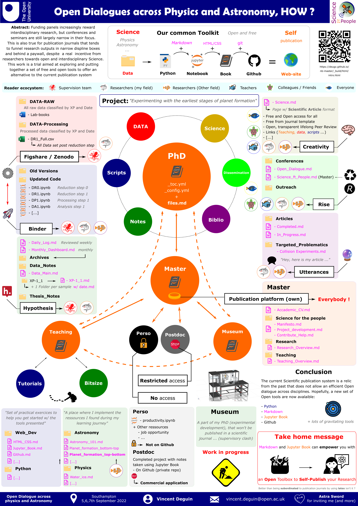

# ODAPA

<p class="emphase">... Across Physics and Astronomy</p>


What a delightfull parentheses that was on this early September 2022 in Southampton at the student conference *Open Dialogues across Physics and Astronomy*. Wonderfully chaired by Astra Sword who invited students and accademics from phyics, astronomy and related fields, to welcome interdisciplinary talk and open dialogues around underlooked issue in Physics and Accademia. This conference was a perfect example of kindness ... 


````{margin} 
**Links**

margin

[Conference web site]

````

## My contribution

````{toggle} Poster
Poster that I presented
```{div} full-width

```
````

## Conference highligts

Mes "coups de coeur"

### Diversity and inclusion

Great representation

### Conference dinner (of course)

It's been a while since I haven't done a Conference, the reason being that since two years, they are mostly online. I mean, what is the point if you can't have a chat with your  


```{admonition} Note Catxere 
I couldn't finished my sentence during our discussion so here it is.
```


When I imagine a new world, I think about it as a planetary scaled Communist organisation, in the sense of global collection , organisation and distribution of the Earth ressources. As such, the whole humanity can ensure that we don't extract more  than what we actually need and can perform  those tasks in the most possible efficient way (energy saving). Of course, I don't see the Earth governed by a single human and deep in my heart, I also like my country and it's borders.  


### PhD hidden curriculum, kindness


# Comments

<script src="https://utteranc.es/client.js"
        repo="Deugz/nb-master"
        issue-term="pathname"
        theme="github-light"
        crossorigin="anonymous"
        async>
</script>
