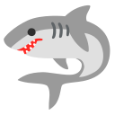

# Manifesto 

## **The Scientific publication system**

````{margin} 

```{seealso}

Some articles talking about scientific puplication

<br>
<br>

- [Guardian](https://www.theguardian.com/science/2017/jun/27/profitable-business-scientific-publishing-bad-for-science) *Is the staggeringly profitable business of scientific publishing bad for science?*


- [The Atlantic](https://www.theatlantic.com/science/archive/2018/04/the-scientific-paper-is-obsolete/556676/) *The Scientific Paper Is Obsolete, Here’s what’s next.* 


- [Works in progress](https://www.worksinprogress.co/issue/the-speed-of-science/) *The speed of science*


- [Guardian](https://www.theguardian.com/books/2022/apr/11/the-big-idea-should-we-get-rid-of-the-scientific-paper) *The big idea: should we get rid of the scientific paper?*

```

````

<h3><strong>&#187;  <u>How it works</u></strong></h3>

<h4><strong>An historical perspective</strong></h4>

Scientific publication begin it's journey in 1665 with the [Philosophical Transactions of the Royal Society](https://en.wikipedia.org/wiki/Philosophical_Transactions_of_the_Royal_Society) with contributions from Isaac Newton, <span class="hovertext" data-hover="First woman ever published in 1787 (An account of a new comet)">Caroline Hershell</span>, Benjamin Franklin, Charles Darwin... Publication of scientific work will remain in the hand of <span class="hovertext" data-hover="Royal Society">scientific society</span> until the end of the second world war, a time when science publishers were notoriously inefficient and constantly broke, but science itself was about to enter a period of unprecedented growth resulting from <strong>government fundings</strong>. 
This is the time choosen by [Robert Maxwell](https://en.wikipedia.org/wiki/Robert_Maxwell) to enter the emerging business of scientific publication by creating the company <span class="hovertext" data-hover="Now owned by Elsevier">Pergamon Press</span>. As science was expanding, it become clear that it would need new journals to cover new areas of study, and while scientific societies argued about the boundaries of their fields, Pergamon just went to convince prominent academics that their particular fields required a new journal and install that person at the reins of it. They would then begin

<p class="emphase">Selling subscriptions to university libraries</p>

which suddenly had a lot of government money to spend. From 40 journals in 1959, Pergamon was publishing 150 titles by 1965, scientific articles became the only way science was represented, and publishers were seen as a necessary partner in the advancement of science. Maxwell had transformed the business of publishing but science remained unchanged and scientist would published their work to whichever journal was the best fit for their research area. It is in the mid 70's that *publications* became an inherent part of scientists career with the 

<h3><strong>&#187;  <u>What is wrong</u></strong></h3>


<h4><strong>Monetisation of knowledge </strong></h4>

:::::{div} full-width

::::{grid} 2

<div>

<h5> <u>for the benefits of <strong>Journals</strong></u> </h5>

- You need to pay to publish (not always, OK, but most of the time)
- You need to pay to have access to publications.

Of course those "fees" are not paid by scientist themseleves, but rather by their institutions or funding bodies. 

</div>
    

<div>
    
<h5> <u>to the detriment of <strong>Researchers</strong></u> </h5>

Interstingly, while I am writing those lines along with wrapping up my PhD thesis, **I am not paid by my institution** - Pretty cruel system don't you think ?

- Increased poverty amoung PhD students
- slavery ...

Doesn't really matt]er because we are passionate about what we do right ?

Well passion doesn't bring food in the table.

</div>
    
::::
    
:::::
    
<h5> <u>Open Access</u> </h5>

Yes, some journals offers Open Access, but very often it is a costly options as you need to pay <span class="hovertext" data-hover="How is this money spend, I don't know">Article Processing Charges</span> (APC).
For Nature they cost 9500 Euros !! (source: <a href="https://www.nature.com/nature-portfolio/open-access" target="blank">Here</a>) 

````{margin}

<div>
    
```{figure} Docs/Elephant.png
---
name: Elephant
---
Elephant
```

</div>
   
    
<div>
    
```{epigraph}
And so these men of Indostan
Disputed loud and long,
<br>
<br>
Each in his own opinion
Exceeding stiff and strong,
<br>
<br>
Though each was partly in the right,
And all were in the wrong!

-- John Godfrey Saxe (1816-1887)
```
</div>
  
````

<h4><strong>Promote competition vs collaboration  </strong></h4>

<h5>Metrics</h5>

Scientist are judged by their number of publication to climb the accademic ladder. This is measured using <span class="hovertext" data-hover="Explain, h-index ...">metrics</span>.


Hence we all tend to **publish quick and numerous papers, rather than well and low number**


    
- Puts scientist away from their main mission, understanding the **bigger picture**
    


<h3><strong>&#187;  <u>What is right</u></strong></h3>

<h4><strong>Peer Review</strong></h4>


<h4><strong>Journal template ?</strong></h4>

Very often publishing fees are justified by the employment of an army of editors that needs to be paid by the journal. Now sit down and think about it, you are actually doing the editorial job by using the journal latex template!

Good and bad:
- You know what you are going to get but:
- prevent creativity in sharing scientific content.
- Reproducibility crisis in Science. 
- Lots of redundancy

Experiments are not described efficiently in scientific papers and hence are **hardly reproducible**, especially when dealing with metastable samples (like ASW)

- Processing softwares not always shared
- Data in databases is not efficiently described and hard to extract, reprocess (give example)

Overall, Scientific work is published in a **Boring** way, even though every piece of Science is interesting.


<h3><strong>&#187;  <u>Summary</u></strong></h3>

Outdated, current technologies should drive us to do better.

<h4><strong>Tools</strong></h4>


<article id="P1">
    
<div id="subdiv2">


:::{grid-item-card}
**Tools** <span style="float: right">&#128165;</span>
^^^

- [JupyterLab](https://jupyter.org/)    
-  Python
-  Markdown
- Jupyter Lab
- ...
    
:::

<br>
<br>
    
- Most usefull for PhD students (use from Start)
- Adaptable to individual needs    

</div>
    
<div id="subdiv2">    
  
The journey towards the completion of a PhD is long, hard and students are very often left alone to develop their skills in order to become an accomplished researcher. There is an incentive from `graduate schools` within Universities to help their student cohort but unfortunately (at least for me), this always translated into a set of administrative burden that are conterproductive (cf Blog post on progress monitoring report). I think every student have their own needs and should be given the opportunity to developp their **own set of tools to match those needs**. For me that is:
    
</div>
    
</article>


## **Next level** 


- <strong>multiscale</strong>

<h3><strong>&#187;  <u>Research Toolbox</u></strong></h3> 

Build a single plateform of your own design (web-site) to manage, store and publish your research with 

<h4><strong>Jupyter-Book </strong></h4> 

Jupyter Book is one component of the [Jupyter ecocystem](link to teaching), an IDE for python. If you have no idea what this means, (), click on the link and have a read through the tutorial. In a nutshell, it is a collection of (Open source) softwares, that help you 

<p class="emphase">build beautiful, publication-quality books and documents from computational content</p>

Takes a collection of `jupyter notebooks` (.ipynb) and `markdown` files (.md), **compile** them to produce a **static web-site** 


:::::{margin} 
::::{grid} 1
:::{grid-item-card} 
:img-top: ../Docs/OU_Logo.svg
:link: "https://deugz.github.io/nb-phd/_build/html/"
^^^
**PhD Part 2** 
+++
 Version: 0.1 
:::
::::
:::::

<h4><strong>Result</strong></h4>

This web-site is a <a href="https://the-turing-way.netlify.app/welcome.html" target="blank"> Research compendium </a> produced using <a href="https://jupyterbook.org/en/stable/intro.html" target="blank"> Jupyter-Book</a>. This book is part of the **Science For the People** project whose aim is to empower researcher to self-publish themselves in an open and innovative way, far from the unsustainable current publication system. This Book focus on my PhD project.

<br>
<br>

Blabla

<br>
<br>

Blabla


<h4><strong>Benefits</strong></h4>

:::::{div} full-width
::::{grid} 1 1 2 3
:class-container: text-center
:gutter: 3

:::{grid-item-card}
:link: Appendix/How_do_I.html
:class-header: bg-light

Notebook ✏️
^^^
A method to **take, store and display my notes (informatically)**

Implemented incrementally w/ `JupyterLab` Using `Markdown` and includes all the requirements of scientific publishing: 
- Bibliography
- Figure referencing 
- ...

and more:

- hyperlink -> web ressources
- ...


:::

:::{grid-item-card}
:link: content/myst.md
:class-header: bg-light

Storage Place ✨
^^^

Web-sites require a solid folder architecture.

- data, 
- scripts
- files
- notes 

Stored all in one place localy (`Hardrive`) and exported periodicly on `Github`
- **Version control**

:::

:::{grid-item-card}
:link: content/executable/index.md
:class-header: bg-light

Project Manager 🔁
^^^

Keep track of my progress and focus on the right tasks.

Outil d'organisation
- Notes
- Agenda
- Taches 
- ...

:::

:::{grid-item-card}
:link: interactive/launchbuttons.md
:class-header: bg-light

Peer-Review Plateform 🚀
^^^
Using `hypothesis` (buttons on the right corner), the whole book content can be commented.
:::

:::{grid-item-card}
:link: build/publish/web.md
:class-header: bg-light

Publication gallery  🎁
^^^
 
Share this notebook with my familly, friends and everyone else. 
:::

:::{grid-item-card}
:link: content/components.md
:class-header: bg-light

FAIR Data ⚡
^^^

Findability, Accessibility, Interoperability and Reusability of my datasets.
:::

:::{grid-item-card}
:link: content/components.md
:class-header: bg-light

Open Processing tools ⚡
^^^

Python Notebooks are available and others can interact with it via `binder`.
:::

:::{grid-item-card}
:link: content/components.md
:class-header: bg-light

Social media ⚡
^^^

Connect Researcher with the general public. Collaboration beyond academia (`utterance` comment)
:::

:::{grid-item-card}
:link: content/components.md
:class-header: bg-light

Communication &#128489;
^^^

- with my supervisors
- Reviewers
- members of the public
- ...


:::


::::
:::::


<h4><strong>Other Online tools</strong></h4>

For conducting research

<h5>Litterature Review</h5>

- [Citation Gecko](https://www.citationgecko.com/)
- [Litmaps](https://www.litmaps.com/)
- [Connected Papers](https://www.connectedpapers.com/)

<h5>Research Management</h5>

- [OSF](https://osf.io/)

<h5>Iterative documents build</h5>

- [Data Science Notes](https://makeuseofdata.com/index.html)

<h5>Example</h5>

- [Lorana A. Barba website](https://lorenabarba.com/)
- [High-Energy Physics](https://inspirehep.net/)


```{admonition} Dialogue  - 
:class: dropdown
Alors certe, il y a probablement des outils plus efficaces et rapides sur le marche, mais j'aime faire <strong>l'apologie de la lenteur</strong>, d'autant plus qu'elle s'accompagne de nombreux benefices egalement ... 

```

<h3><strong>&#187;  <u>Editorial canvas</u></strong></h3> 

<strong>Sandbox</strong> - define term

<h4><strong>For your Research ...</strong></h4>

Write as you go along they said ... It will be fun they said ...

<p class="emphase">Markdown vs Latex or Word ?</p>

One is relatively painfull and mostly serve the purpose of fitting within scientific journal edition templates. The other however, with the help of `Jupyter Book` gives you a serie of advantages shown below:  

<h5>Benefits</h5>

- Work is publishable as you go along (or not), and you can get **feedback** at every steps during your scientific journey, and that my friend is the best to learn and have a sain PhD journey.  

- Your are your own editor, you don't have to obey any boring format. What we are doing as Researcher is great and exciting so ffs share it like that.  
    - creativity

- Choose your audience (multiple)

Overall,

- More than just a template

<h6><u>Readibility</u></h6>

Readability is the search for factors in reading material which could be easily and objectively counted.**Positivist paradigm** stated that reading difficulties is influenced by four factors, content, stylistic elements, format and organisation. Among these elements, factors such as vocabulary load, sentence structure, idea density and human interest appeared to be significantly related to reading difficulty. **Cognitive science** (date) bring a new perspective which emphasized the interactive nature of reading and the constructive nature of comprehension. Comprehension is related to the cognitive process of searching for meaning, that is no longer viewed as coming from the text, but, rather, from the readers mind in interaction with the text.

Because of its collaborative nature, and the ability to collect readers experience, I think this web-site can be a great research plateform to investigate readability, accrose the full spectrum of audiences. 

High **readibility** (process of matching the reader and the text) by allowing the readers () to navigate


- [Ref](https://scholar.google.co.uk/scholar?q=Alexander,+P.+%26+Fox,+E.+(2006).%E2%80%9CA+historical+perspective+on+reading+research+and+practice&hl=fr&as_sdt=0&as_vis=1&oi=scholart)
- [Historical Reviews](https://pressbooks.howardcc.edu/app/uploads/sites/10/2019/06/A_Historical_Perspective_on_Reading_Research_and_P.pdf)

<h4>More</h4>

- [Vocabs - Astronomy thesaurus](https://vocabs.ardc.edu.au/repository/api/lda/aas/the-unified-astronomy-thesaurus/current/resource.html?uri=http://astrothesaurus.org/uat/2092)

```{note}

- Use that vocabulary to generate specific tags for the research produced

```


<h4><strong>... And all the other things orbiting around it!</strong></h4>

<h5>Teaching material</h5>

:::::{div} full-width

<article id="P1">

<div id="subdiv2">

This is a brief attempt to explain how **Education** works.
    
The body of the tree represent the education system. The trunk being the common set of knowledge that we are given in highschool (which is mandatory for all, as far as I know). The branches represent the University, and at that point the system diverge into different discipline, at bachelor level and subsequently when you get to do a Master. The leafs actually represent Researches that **creates new knowledge**    
    
- Interdisciplanary Science
    
The orange leaf is my friend Ross, he is also studying *the earliest stages of planet formation* but he is a **geologist** (poor him I know)    
  
**Examples**:
    
- [Dartois](http://hebergement.u-psud.fr/edartois/Teaching.html)

</div>
    
    
    
<div id="subdiv2">


```{figure} Docs/Education_tree.png
---
name: Tree
---
Education image
```

</div>
    

</article>
    
:::::


<h5>Presentations / Posters</h5>

- Recycle your talks ! 

Put them online and give them a quick twist to fit a wider audience.


<h3><strong>&#187;  <u>Publication plateform</u></strong></h3>

- Publication are rattached to your own profile rather than belonging to a journal

- **Free** (no paywall)
<div>
<script src="../_static/assets/svg_animated_links.js"></script>
</div>
[source](https://codepen.io/aymak/pen/WNzdLLe)


<h4>Example</h4>

- [Formatting idea](https://www.julian.com/)

<h5>The Future</h5>

- [StarAtlas](https://staratlas.com/)


<h3><strong>&#187;  <u>Plateform for Collaboration</u></strong></h3> 


What I would like to explore is how we can bring researchers (from various disciplines) to work together on a given problematic, rather than competing with each other. I think that such a plateform can help in promoting this **collaborative approach**.

- promote collaboration rather than competition

- L'entraide pour rendre accessible du contenue educatif de pointe, de qualite et accessible a tous!

L'emploie du ton familier (universel).

You will have to put some efforts to make it work, but you will build a tool that can follow you during your whole career. 

I think it is worth a try (link to jupyter-book tuto)

<h3><strong>&#187;  <u>Communication</u></strong></h3>


````{margin} 
```{admonition} Idea for later

- Add span div that appear when the fish in aquarium is hovered.
- Create specific admonitions for each fish type
- Add student fish (floating on his back at surface ^^)

```
````

<h4><strong>Who are you ?</strong></h4>

I aim to deliver content for **everybody** `interested in Science`, so let me know who you are and I will point you in the right direction.

<article id="P1">
    
<div id="subdiv2-3">


    
```{image} ../Docs/Aquarium.png
---
name: Aquarium
---
```

</div>
    
<div id="subdiv1-3">    

**Legend**
    
 <span class="hovertext" data-hover="Yes, I think Science must be shared with everyone and it is the responsability of scientists to find new publication methods and formats to achieve this goal.">Anyone</span>

 Friends/Colleagues

 Teachers
    
 Researchers (other fields)
    
 Researchers (my field)
    
 Supervision team

</div>
    
</article>


<h3><strong>&#187;  <u>Sociale & politique</u></strong></h3>

- More **impact** on Society

- Enseignement

- Créer une société de chercheurs indépendants

    - délivré de la bureaucratie qui gangrène le milieu accadémique, mais également du monopole des sociétés de publication.


# Comments

<script src="https://utteranc.es/client.js"
        repo="Deugz/nb-master"
        issue-term="pathname"
        theme="github-light"
        crossorigin="anonymous"
        async>
</script>
