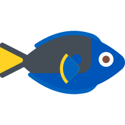
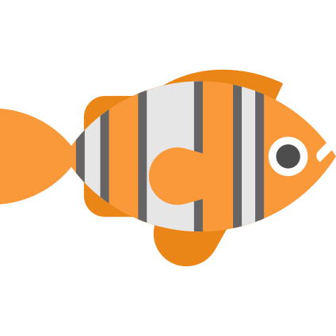

# Online Format

***


<h3> <strong> <u>  Introduction </u></strong> </h3>

<br>

:::::{div} full-width
::::{grid} 3

:::{grid-item}
:columns: 6

During my PhD, I spent quite a fair bit of time to think about novel methodology to publish research. 

**Those online book are**:
- lifelong notes related to the topic of planet formation and amorphous ice
- an intermediate step towards the production of my Master Thesis.

:::

:::{grid-item}
:columns: 1

:::

:::{grid-item}
:columns: 5

**Plan**

- [**How**](content:references:Title1) 
    - Tools 
    - Workflow
        - Daily Notes Implementation
        - Supervision
        - Publication
        - Peer Review
        
<br>

- [**Why**](content:references:Title2)
    - Open Toolbox
    - Alternative Publication
    - Enhanced Science Communication
        - Create a Dialogue
        - Greater Impact
        
<br>
        
- [**Can I?**](content:references:Title3)
    - A Bit of Context
        - The Open University
        - My PhD
    - PhD Thesis Requirement
    
<br>

- [**What is next?**](content:references:Title4)

:::
::::
:::::

***

:::{div} full-width

<p class="emphase2"><strong>Multiple Outputs</strong></p>

<p class="emphase">As a result, the outputs of my scientific journey extend far beyond the restrictive scope of a thesis</p>

<p class="emphase"></p>

<br>

:::

:::::{div} full-width

::::{grid} 4

:::{grid-item-card}
:link: https://deugz.github.io/nb-phd/_build/html/intro.html
:class-header: bg-light
**Open Notes A**
^^^

```{image} ../../_static/Logo/logo_SFTP.png
:width: 83%
:align: center

```

+++

Anita

:::

:::{grid-item-card}
:link: https://deugz.github.io/nb-museum/_build/html/intro.html
:class-header: bg-light
**Open Notes B**
^^^

```{image} ../../_static/Logo/logo_SFTP.png
:width: 83%
:align: center
```

+++

Helen

:::

:::{grid-item-card}
:class-header: bg-light
**Web**
^^^

<br>

```{image} ../../_static/Logo/OU_logo.png

```

<br>
<br>

+++
Corpus + Extra material
:::

:::{grid-item-card}
:link: https://deugz.github.io/nb-teaching/_build/html/intro.html
:class-header: bg-light
**School 2.A**
^^^

```{image} ../../_static/Logo/logo_SFTP.png
:width: 83%
:align: center

```

+++

Extra Work

:::

::::

:::::


***


:::{margin}

<script src="https://unpkg.com/@lottiefiles/lottie-player@latest/dist/lottie-player.js"></script>
<lottie-player src="https://assets10.lottiefiles.com/packages/lf20_tsdnk8ut.json"  background="transparent"  speed="1"  style="width: 100%; height: auto;"  loop  autoplay></lottie-player>

:::

(content:references:Title1)= 
## How ?

<p class="emphase2"> with <strong> Markdown </strong></p>

<p class="emphase"> And very few lines of code </p>


:::{div} full-width


> The first thing I hear when I tell people that I am writing a website is: *Oh that must be difficult*. It is actually **easy** and rely on two tools, both developped by the [Executable Books](https://executablebooks.org/en/latest/) organization. They both gives the opportunity to build a static website from a collection of markdown files.

:::

### <strong> &#x2023; <u> Tools </u></strong> 


:::::{div} full-width

::::{grid} 2

:::{grid-item-card}
:class-header: bg-light
<span style="float: right"></span> **Jupyter Book**
^^^

<p class="emphase"> A command-line interface for building <strong>beautiful, publication-quality books</strong> and documents from computational content. </p>

+++
- [Documentation](https://jupyterbook.org/en/stable/intro.html#)

:::

:::{grid-item-card}
:class-header: bg-light
<span style="float: right"></span> **Myst Markdown**
^^^

<p class="emphase"> An extensible, semantic, and community-driven flavor of <em>markdown</em> designed for <strong>scientific and computational narratives</strong>. </p>


+++
- [Documentation](https://myst-tools.org/) / [Demonstration](https://myst-tools.org/sandbox) 

:::

::::

<br>

<p class="emphase2"> <strong> The Mindset </strong></p>

<p class="emphase"> Good values inherited from the <strong>Open Science</strong> community</p>

<br>
<br>

::::{grid} 7

:::{grid-item-card}
:class-header: bg-light
**Open**
^^^

```{image} ../../_static/SVG_files/open-svgrepo-com.svg

```

:::

:::{grid-item-card}
:class-header: bg-light
**Transparent**
^^^

```{image} ../../_static/SVG_files/color-lineal-magnifying-glass-svgrepo-com.svg

```

:::

:::{grid-item-card}
:class-header: bg-light
**Kind**
^^^

```{image} ../../_static/SVG_files/loving-charity-svgrepo-com.svg

```

:::

:::{grid-item-card}
:class-header: bg-light
**Interactif**
^^^

```{image} ../../_static/SVG_icons/basketball/basketball-player-with-the-ball-svgrepo-com.svg

```

:::

:::{grid-item-card}
:class-header: bg-light
**Creatif**
^^^

```{image} ../../_static/SVG_files/abstract-painting-ic-national-culture-paris-svgrepo-com.svg

```

:::

:::{grid-item-card}
:class-header: bg-light
**Inclusif**
^^^


```{image} ../../_static/SVG_files/global-community-population-overpopulation-svgrepo-com.svg

```

:::

:::{grid-item-card}
:class-header: bg-light
**Collaboratif**
^^^

```{image} ../../_static/SVG_files/work-together-collaborate-co-operate-join-forces-svgrepo-com.svg

```

:::

::::

:::::


### <strong> &#x2023; <u> Workflow </u></strong>

#### <strong> &#x2023; &#x2023; Daily Notes Implementation </strong>

<br>


:::::{div} full-width

::::{grid} 3

:::{grid-item}
:columns: 4

> The **scientific method** is well established since the 17<sup>th</sup> century, and every step rely on carefull notes to document the process. Very little progress (nor investigations or effort) have been made in note taking capabilities to reflect the recent technological advancement of our society and enhance scientific notes. I believe my online note taking routine is a great improvement (with respect to hand written notes) and it gives me multiple benefits (cf card right)

:::

:::{grid-item}
:columns: 5


```{image} Docs/The_Scientific_Method.svg
:width: 90%
:align: center
```


:::


:::{grid-item-card}
:link: https://deugz.github.io/nb-master/_build/html/Appendix/How_do/How_do_I.html
:class-header: bg-light
:columns: 3
**How do I**
^^^

- Notebook
- Edition
- Storage
- Open Science
- Communication
- Collaboration
- Publications
- Engagement
- Management
- Social media

:::

::::

:::::

***

#### <strong> &#x2023; &#x2023; Supervision </strong>

:::::{div} full-width

::::{grid} 2

:::{grid-item}
:columns: 9

> It is not trivial to get the best out of your supervisory team. The Open University pay a third party company for a *PGR Manager*, but like any tool designed for all, it is nowhere near fitting everyone need. Everybody should be given the chance to developp his/her own tools. Click on the card to know more (cf right)


:::


:::{grid-item-card}
:link: Organisation.html
:class-header: bg-light
:columns: 3
**Supervision / Plan**
^^^

- Montly Plan
- Weekly Notes

:::

::::

:::::

##### <strong> Interaction Post-it </strong>

:::::{div} full-width
::::{grid} 4

```{admonition} Note / Question
Sometimes, for the purpose of interactivity, I will ask you some questions, feel free to comment your answers &#128521;
```

```{warning}
I would &#10084; you to comment every word of this website. But please be **mindfull** of the &#9999; pages that are formal thesis pages. 
```

```{admonition} Info / Idea
:class: tip
Info and Ideas
```

```{admonition} See also
:class: seealso
The best advantage of a web-site is that you can link to various other pages or documents, so go check those out!
```


::::
:::::

***

#### <strong> &#x2023; &#x2023; Publication </strong>

<br>

:::::::{div} full-width

::::::{grid} 2

<br>

:::::{grid-item}
:columns: 6

### Notes 

<br>

<p class="emphase">Not submitted</p>

<br>

::::{grid} 2

:::{grid-item-card}
:link: https://deugz.github.io/nb-phd/_build/html/intro.html
:class-header: bg-light
**Open Notes A**
^^^

```{image} ../../_static/Logo/logo_SFTP.png
:width: 83%
:align: center

```

+++

Anita

:::

:::{grid-item-card}
:link: https://deugz.github.io/nb-museum/_build/html/intro.html
:class-header: bg-light
**Open Notes B**
^^^

```{image} ../../_static/Logo/logo_SFTP.png
:width: 83%
:align: center
```

+++

Helen

:::


::::

:::::

:::::{grid-item}
:columns: 6

### Thesis

<br>

<p class="emphase"><strong>Submitted</strong></p>

<br>

::::{grid} 2

<br>
<br>

:::{grid-item-card}
:class-header: bg-light
**Web**
^^^

<br>

```{image} ../../_static/Logo/OU_logo.png

```

<br>
<br>

+++
Corpus + Extra material
:::

:::{grid-item-card}
:class-header: bg-light
**PDF**
^^^

<br>

```{image} ../../_static/Logo/OU_logo.png

```

<br>
<br>

+++
Corpus
:::


::::

:::::

::::::


```{image} Docs/Tools-overview2.png

```


:::::::

<br>
<br>

::::::{div} full-width

:::::{grid} 2

::::{grid-item}

:::{dropdown} More info

:::

::::

::::{grid-item}

:::{dropdown} More info

:::

::::

:::::

::::::

<br>
<br>

::::{margin}

```{admonition} Upload <span style="float: right"></span>

<br>

- **Notes**: weekly 

- **Thesis**: monthly 

```

::::

> Multiple ways to publish, all complementary 


##### <strong>Differences between notes and thesis</strong>

::::::::{div} full-width
:::::::{dropdown} Sesction per section 

::::::{tab-set}

:::::{tab-item} Introduction

::::{grid} 2

:::{grid-item}

Explanation, difference between the 2 format
- More inputs: video, podcast (link with litterature below (Bourne))

:::

:::{grid-item}

```{figure} Docs/Funnel_final.png
---
name: Funnel-explanation
width: 400px
---

Explanation

```

:::

::::


:::::

:::::{tab-item} Method


:::::

:::::{tab-item} Results 


:::::


::::::
:::::::
::::::::


***


#### <strong> &#x2023; &#x2023; Peer Review</strong>
 
::::{margin}    
```{image} ../../_static/Images/Hypothesis_symbols.png
:width: 50px
:class: float
:align: center
```
::::

    
::::{grid} 2

:::{grid-item}
:columns: 7
    
> I am using `Hypothesis` as a Peer Review tool. Just higlight any word, sentense or paragraph of this website and you will see apeearing two buttons as shown in the image. If you click on the **annotate button**, you will be able to write your comment directly on the web-page.     

:::

:::{grid-item}
:columns: 5
    
```{image} ../../_static/Images/Coment_capture.PNG
:width: 400px
:class: float
:align: center
```
    
:::


::::


::::{div} full-width

<p class="emphase2"> in <strong> Summary </strong></p>

<p class="emphase">Proof of concept that science can be self-published and delivered online as a Research <span class="hovertext" data-hover="a comprehensive collection of information and analysis pertaining to a body of knowledge"><strong>compendium</strong></span></p>

::::


    
    


:::{margin}

<script src="https://unpkg.com/@lottiefiles/lottie-player@latest/dist/lottie-player.js"></script>
<lottie-player src="https://assets1.lottiefiles.com/private_files/lf30_3ijiy6.json"  background="transparent"  speed="0.3"  style="width: 100%; height: auto;"  loop  autoplay></lottie-player>

:::

(content:references:Title1)= 
## Why ?

<p class="emphase2"> <strong> Open Toolbox </strong></p>

<p class="emphase"> For PhD Students and Researchers interested in <strong>Open Science</strong></p>


:::::{div} full-width

> Publishing my research online has proven extremely challenging and I had to learn many skills along the way (hopefully the developper community is incredibely open but the information is scattered all over the internet). While learning and implementing the solutions I found, I took time to developpe some tutorials to help like minded scientist to follow my path.

<br>

::::{grid} 6


:::{grid-item-card}
:class-header: bg-light
**Open Science**
^^^

```{image} ../../_static/SVG_files/Open_Access_logo_PLoS_transparent.svg
:width: 60%
:align: center
```

:::

:::{grid-item-card}
:class-header: bg-light
**Anaconda**
^^^

```{image} ../../_static/Images/Anaconda_logo.png

```

:::

:::{grid-item-card}
:class-header: bg-light
**Online Books**
^^^

```{image} ../../_static/Images/logo_JB.png
:width: 110%

```

:::


:::{grid-item-card}
:class-header: bg-light
**Github**
^^^

```{image} ../../_static/SVG_icons/github-svgrepo-com.svg
:width: 90%
:align: center

```

:::

:::{grid-item-card}
:class-header: bg-light
**Binder**
^^^

```{image} ../../_static/Images/Binder_logo.png

```

:::

:::{grid-item-card}
:class-header: bg-light
**Semantic Web**
^^^

<br>

```{image} ../../_static/SVG_files/w3c_home_nb-v.svg

```

:::


::::

<br>

<p class="emphase"> And many more, all together opening the doors for ...</p>


:::::


<br>

:::{div} full-width

<p class="emphase2"> <strong> Alternative publication </strong></p>

<p class="emphase"> We all know scientific publication needs to change! </p>

:::


:::::{div} full-width

::::{grid} 2

:::{grid-item}
:columns: 9


> Scientific communication today is designed around print documents and pay-walled access to content. Over the last decade, the open-science movement has accelerated the use of pre-print services and data archives that are vastly improving the accessibility of scientific content. However, these systems are not designed for communicating modern scientific outputs, which encompasses so much more than a paper-centric model of the scholarly literature.


- {cite:p}`Bourne2012` 


:::


:::{grid-item-card}
:link: https://deugz.github.io/nb-master/_build/html/Projects/Manifesto.html
:class-header: bg-light
:columns: 3
**Manifesto**
^^^

- Manifesto

- Scientific Publication

:::

::::

<p class="emphase"> So why not <strong>experiment </strong> ?</p>

:::::


:::::{div} full-width
::::{grid} 3

:::{grid-item}
:columns: 4

#### Papers

Explain 

:::

:::{grid-item}
:columns: 4

<br>

> There is two main ways in which scientists share their work:


<script src="https://unpkg.com/@lottiefiles/lottie-player@latest/dist/lottie-player.js"></script>
<lottie-player src="https://assets9.lottiefiles.com/packages/lf20_aiwawyjf.json"  background="transparent"  speed="0.8"  style="width: 100%; height: auto;"  loop  autoplay></lottie-player>


:::

:::{grid-item}
:columns: 4

#### Presentations

Explain

:::

::::

:::::


### <strong> &#x2023; <u> Differences </u></strong>

:::::{div} full-width

::::{dropdown} PhD Deliverables


```{figure} ../../_static/Ontology/Export/PhD_V2_fancy.png
---
name: MC_X
width: 2000px
---
Source
```


::::

- Granularity

- self-own / 

- lifelong


<p class="emphase"> Is it better ? I don't know but it is a good starting point to explore how we can change the publication landscape </p>


:::::

:::::{div} full-width


<br>

<p class="emphase2"> <strong> Enhanced Science Communication </strong></p>

<p class="emphase"> Science can be very daunting at first </p>

<br>

::::{grid} 2

:::{grid-item}
:columns: 6


> And it is, actually, a frightening place to set foot. 

:::

:::{grid-item}
:columns: 6

<script src="https://unpkg.com/@lottiefiles/lottie-player@latest/dist/lottie-player.js"></script>
<lottie-player src="https://assets10.lottiefiles.com/packages/lf20_qsgqcwag.json"  background="transparent"  speed="1"  style="width: 100%; height: auto;"  loop  autoplay></lottie-player>

:::

::::

<br>

<p class="emphase"> The reason lie in it's publication method </p>

<br>

::::{grid} 2

:::{grid-item}
:columns: 6

> Explanation

:::

:::{grid-item}
:columns: 6

<script src="https://unpkg.com/@lottiefiles/lottie-player@latest/dist/lottie-player.js"></script>
<lottie-player src="https://assets4.lottiefiles.com/private_files/lf30_nep75hmm.json"  background="transparent"  speed="0.4"  style="width: 100%; height: auto;"  loop  autoplay></lottie-player>


:::

::::

<br>

<p class="emphase"> My Solution </p>

<br>

::::{grid} 2

:::{grid-item}
:columns: 6

> Different approach to publication


:::

:::{grid-item}
:columns: 6

```{figure} Docs/Red_sea_coral_reef.jpg

[Source](https://commons.wikimedia.org/wiki/File:Red_sea_coral_reef.jpg)
```


:::

::::


:::::

### <strong> &#x2023; <u> Create a dialogue ...</u></strong>


:::::{div} full-width

>I aim to deliver the scientific knowledge that I produced using a **conversational tone**. I think it can help attracting a much wider audience without doing any harm to the scientific content itself. A website offer a limitless set of tools to achieve that goal.  

:::::

#### <strong> &#x2023; &#x2023; ... with the full spectrum of audiences</strong>

:::::{div} full-width

::::{grid} 2

    
:::{grid-item}
:columns: 8

>This web-site is an experiment aimed at <strong>communicating research </strong>. Communication involve an audience, and there is a whole diapora of possible audiences for this project: 
In order to communicate, I will leave notes (4 types, cf below) here and there, sometimes with a tag refering to the audience they are adressed to.
  

  
:::

:::{grid-item-card}
:class-header: bg-light
:columns: 4

**Legend** <span style="float: right"></span>
^^^
    
-  <span class="hovertext" data-hover="">Supervision team</span>

-  <span class="hovertext" data-hover="">Researchers (my field)</span> 

-  <span class="hovertext" data-hover="">Friends/Colleagues</span>

-  <span class="hovertext" data-hover="">Anyone</span>

-  <span class="hovertext" data-hover="">Teachers</span> 


-  <span class="hovertext" data-hover="">Researchers (other fields)</span> 

   
:::

::::

:::::

#### <strong> &#x2023; &#x2023; And the help of </strong>


##### <strong>School 2.A</strong>

:::::{div} full-width

::::{grid} 2

    
:::{grid-item}
:columns: 9

> Explain
- We learn best when we teach what we learn.

- We learn best not from experts, but from someone who's only one step ahead.

:::

:::{grid-item-card}
:link: https://deugz.github.io/nb-teaching/_build/html/intro.html
:class-header: bg-light
:columns: 3
**School 2.A**
^^^

```{image} ../../_static/Logo/logo_SFTP.png
:width: 83%
:align: center

```

+++

Extra Work

:::

::::

:::::

##### <strong>Other Researchers</strong>

<h3><strong>&#187;  <u>Greater Impact </u></strong></h3> 
    


(content:references:Title3)= 
## Can I ?

<p class="emphase"> Actually submit an <strong>Online Thesis </strong></p>

### <strong>&#187;  <u>A bit of context </u></strong>

#### <strong> The Open University</strong>

> The Open University (OU) is a values-led institution which seeks to be *“Open to people, places, methods and ideas”*. It also says to champions openly shared, engaged research of all kinds alongside its world-leading approach to online teaching ([Source](https://www.open.ac.uk/research/support-researchers/open-university-statement-responsible-use-research-metrics)).


```{note}

insert card toward OU web-site with logo ...

```


#### <strong> My PhD</strong>


::::::::{div} full-width
:::::::{dropdown} PhD Journey (in a nutshell)

::::::{tab-set}

:::::{tab-item} The Start

::::{grid} 2

:::{grid-item}
:columns: 9

:::

:::{grid-item}
:columns: 3


<script src="https://unpkg.com/@lottiefiles/lottie-player@latest/dist/lottie-player.js"></script>
<lottie-player src="https://assets5.lottiefiles.com/temp/lf20_2BmOqX.json"  background="transparent"  speed="1"  style="width: 300px; height: 300px;"  loop  autoplay></lottie-player>

:::

::::


:::::

:::::{tab-item} Project B

::::{grid} 2

:::{grid-item}
:columns: 9

Explanation

:::

:::{grid-item}
:columns: 3


<script src="https://unpkg.com/@lottiefiles/lottie-player@latest/dist/lottie-player.js"></script>
<lottie-player src="https://assets2.lottiefiles.com/datafiles/79YVXEKLbyXqdNpBhLN2HNpIaf0riunhFmey8w9J/animation.json"  background="transparent"  speed="1"  style="width: 300px; height: 300px;"  loop  autoplay></lottie-player>

:::

::::


:::::

:::::{tab-item} Troubles

::::{grid} 2

:::{grid-item}
:columns: 9

Explanation

:::

:::{grid-item}
:columns: 3


<script src="https://unpkg.com/@lottiefiles/lottie-player@latest/dist/lottie-player.js"></script>
<lottie-player src="https://assets2.lottiefiles.com/datafiles/kMQNVR3bKPEcxj17aYmvNOqBHkaTLJlv1ECQLqNs/Animation.json"  background="transparent"  speed="1"  style="width: 300px; height: 300px;"  loop  autoplay></lottie-player>

:::

::::


:::::

:::::{tab-item} Project A

::::{grid} 2

:::{grid-item}
:columns: 9

Explanation

:::

:::{grid-item}
:columns: 3


<script src="https://unpkg.com/@lottiefiles/lottie-player@latest/dist/lottie-player.js"></script>
<lottie-player src="https://assets2.lottiefiles.com/datafiles/w6iRO3X4bUd71c8WhIdAipc4b7fZaNekKEyjbQ1L/Animation.json"  background="transparent"  speed="1"  style="width: 300px; height: 300px;"  loop  autoplay></lottie-player>

:::

::::


:::::

:::::{tab-item} Thesis Writing

::::{grid} 2

:::{grid-item}
:columns: 9

Explanation

:::

:::{grid-item}
:columns: 3


<script src="https://unpkg.com/@lottiefiles/lottie-player@latest/dist/lottie-player.js"></script>
<lottie-player src="https://assets2.lottiefiles.com/datafiles/kRhvpsl7lHKUn6dPxM4o5TOHuR8hAzkLqdMhyR9Q/animation.json"  background="transparent"  speed="1"  style="width: 300px; height: 300px;"  loop  autoplay></lottie-player>

:::

::::


:::::


::::::
:::::::
::::::::


### <strong>&#187;  <u>PhD Thesis requirements  </u></strong>


- **Documents**: [Research Degree Regulations - OU](../../_static/assets/pdf/research-degree-regulations.pdf)

***


::::::{div} full-width


```{epigraph}

A PhD, MPhil or Professional Doctorate OU dissertation is normally a <span class="hovertext" data-hover="Definition">monograph</span>, that is, a single, coherent narrative that articulates the thesis and the evidence that supports it. Any additional elements (e.g., non-book components) must be properly integrated into the narrative to provide a coherent and comprehensive whole. The dissertation must satisfy OU standards of presentation and the QAA research degree characteristics (Appendix 1 of the Research Degree Regulations)

-- Thesis Submission Guidelines, Research Degrees, The Open University
```

:::::{dropdown} Requirements

::::{tab-set}

:::{tab-item} 1

<p class="emphase">Search for, discover, access, retrieve, sift, interpret, analyse, evaluate, manage, conserve and communicate an ever-increasing volume of knowledge from a range of sources. </p>


:::

:::{tab-item} 2

<p class="emphase">Think critically about problems to produce innovative solutions and create new knowledge</p>

:::

:::{tab-item} 3


<p class="emphase">Plan, manage and deliver projects, selecting and justifying appropriate methodological processes while recognising, evaluating and minimising the risks involved and impact on the environment</p>


:::

:::{tab-item} 4

<p class="emphase"> Exercise professional standards in research and research integrity, and engage in professional practice, including ethical, legal, and health and safety aspects, bringing enthusiasm, perseverance and integrity to bear on their work activities </p>

:::


:::{tab-item} 5

<p class="emphase"> Support, collaborate with and lead colleagues, using a range of teaching, communication and networking skills to influence practice and policy in diverse environments </p>

:::

:::{tab-item} 6

<p class="emphase"> Appreciate the need to engage in research with impact and to be able to communicate it to diverse audiences, including the public </p>

:::

:::{tab-item} 7

<p class="emphase"> Build relationships with peers, senior colleagues, students and stakeholders with sensitivity to equality, diversity and cultural issues </p>

:::


::::
:::::

#### <strong> Book / Non-Book Component </strong> 

> I have not found any precision about what is meant by book in the *Research Degree Regulations*, hence I went to look for a definition in the Oxford dictionary where it is said that:


<p class="emphase">A <strong>book</strong> is a written work published in printed or <strong>electronic</strong> form</p>

> It is stipulated that a non-book component can be included. As a result I think I should be allowed to publish a thesis that is 100% online


#### <strong> Physical copie </strong>


```{epigraph}

You will need to submit an electronic copy of your thesis at submission. The electronic copy should be submitted in **PDF** format to the Research Degrees Team through [PGR Manager](https://doctoral-research-system.open.ac.uk/) 

-- Thesis Submission Guidelines, Research Degrees, The Open University

```

> It is stipulated in the regulation that a pdf copy has to be submitted. This is the only sentence that is preventing me to submit my thesis as a web-site ... It doesn't look like much, considering all the       > benefits that could arise from such a way to publish, and yet I have been told this is incredibely complicated to change. This is how far we are from progress. 


:::::{dropdown} Personal reflexion on the inefficiency and detrimental effect of heavy administration 

::::{tab-set}

:::{tab-item} Gender equality

<p class="emphase"> Pay Gap </p>


:::

:::{tab-item} Topic 2

Topic 2

:::


::::
:::::

::::::


(content:references:Title4)= 
## What is next ?
