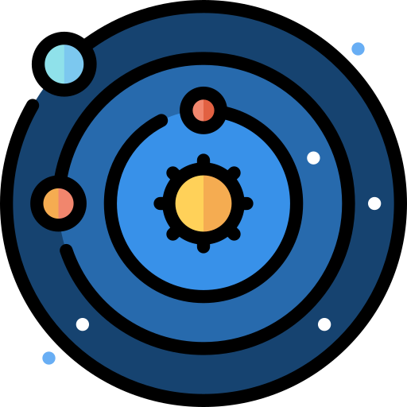
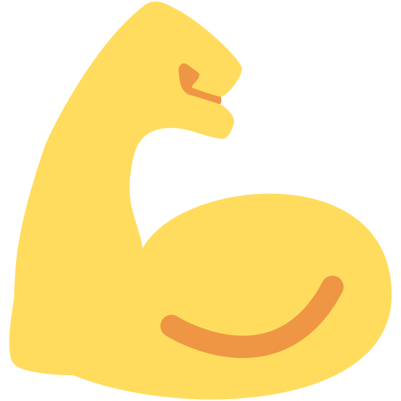

<!--Start of Tawk.to Script-->
<script type="text/javascript">
var Tawk_API=Tawk_API||{}, Tawk_LoadStart=new Date();
(function(){
var s1=document.createElement("script"),s0=document.getElementsByTagName("script")[0];
s1.async=true;
s1.src='https://embed.tawk.to/63da4028c2f1ac1e2030c5e3/1go68l7fv';
s1.charset='UTF-8';
s1.setAttribute('crossorigin','*');
s0.parentNode.insertBefore(s1,s0);
})();
</script>
<!--End of Tawk.to Script-->

# Science 2.

::::{margin} 


<div id="colour">
    
<p class="emphase"> <em>By</em>     
<br><br><strong>Vincent Deguin</strong> 
<br>
</p> 

***
    
 French (32 yo)

 PhD student

 The Open university, UK

 vincent.deguin@open.ac.uk

 [Vincent Deguin](https://www.researchgate.net/profile/Vincent-Deguin)

 [0000-0003-2280-8273](https://orcid.org/0000-0003-2280-8273)

 [Deugz](https://github.com/Deugz)

 [Deugz](https://codepen.io/deugz/)

 [Youtube](https://codepen.io/deugz/)
    
</div>

::::

***

<br>

<p class="emphase">A self-own, independant, interactive and lifelong <strong>online scientific publication and public engagement plateform</strong>, aimed at promoting collaboration between multi-disciplinary scientistist, by providing the space and the tools to create and sustain a constructive dialogue shared openly with the public, around a broad scientific topic:</p>


::::{grid} 2

:::{grid-item}
:columns: 4


<script src="https://unpkg.com/@lottiefiles/lottie-player@latest/dist/lottie-player.js"></script>
<lottie-player src="https://assets2.lottiefiles.com/private_files/lf30_OadeVs.json"  background="transparent"  speed="1"  style="width:100%; height:100%;" hover></lottie-player>

:::

:::{grid-item}
:columns: 8


<br>

<p class="emphase2"><strong>Ices in Space</strong></p>


```{epigraph}

And their role in <strong>Planet Formation</strong>. <br> Explore, have fun, and contribute 😄.


-- **Vince**, editor / publisher
```
:::
::::

<br>


***

**This website**:

:::{div} full-width

 - <span class="hovertext" data-hover="Experimenting with the earliest stages of planet formation">Experiment</span> &nbsp;&nbsp;&nbsp;&nbsp;  - <span class="hovertext" data-hover="Experimenting with the earliest stages of planet formation">Work in progress</span> &nbsp;&nbsp;&nbsp;&nbsp;  - <span class="hovertext" data-hover="Experimenting with the earliest stages of planet formation">a Journey</span> &nbsp;&nbsp;&nbsp;&nbsp;  - <span class="hovertext" data-hover="Experimenting with the earliest stages of planet formation">Participative</span> &nbsp;&nbsp;&nbsp;&nbsp;  - <span class="hovertext" data-hover="Experimenting with the earliest stages of planet formation">Online Free Book</span>

:::


***

<br>
<br>
<br>


<div class="video-div">
<iframe  id="stickyAnchor" class="v-page-anchor float-left" src="https://www.youtube.com/embed/ZC488_LS42o?enablejsapi=1" frameborder="0" fullscreen width="0" height="0" style="margin:auto;"></iframe>
</div>
<script src="https://www.youtube.com/iframe_api"></script>
<script src='https://cdnjs.cloudflare.com/ajax/libs/jquery/3.1.0/jquery.min.js'></script><script  src="_static/assets/script/scriptvideo.js"></script>

:::::{div} full-width


<p class="emphase2"><span class="hovertext" data-hover="Video"><strong>Welcome</strong></span> &nbsp; 👋 </p>


<br>
<br>


::::{grid} 1 1 2 5
:class-container: text-center
:gutter: 3

:::{grid-item-card}
:class-header: bg-light
:link: Profile/Interests.html
<span style="float: right"></span>  **Profile** 
^^^

postcard pic

:::

:::{grid-item-card}
:class-header: bg-light
:link: Projects/Science_ft_People.html
<span style="float: right"></span>  **Project** 
^^^

What I am trying to achieve, why and how.

:::

:::{grid-item-card}
:class-header: bg-light
:link: Research/Research_Main.html
<span style="float: right"></span>  **Research** 
^^^

My research outputs, classified by projects, written in a creative and open access format. 

:::
:::{grid-item-card}
:class-header: bg-light
:link: Teaching/Teaching_main.html
<span style="float: right">&#128640;</span> **Teaching** 
^^^

Teaching material based on what I learned during my scientific journey and collaborative space.

:::

:::{grid-item-card}
:class-header: bg-light
:link: Blog/Blog_Main.html
<span style="float: right">&#128165;</span> **Blog** 
^^^

Because why not ?

:::
::::
:::::

<br>
<br>


::::{div} full-width

<h3><strong>&#187;  <u>Map</u></strong></h3>

```{figure} Docs/Ontology/Export/Master_Ont_1.png
:name: Ontology
:width: 3000px
Knowledge graph obtain from [webvowl](https://service.tib.eu/webvowl/) using a custom ontology generated via [protege](link) 
```

::::


## **Science For The People** 

:::::{div} full-width

<br>
<br>

<p class="emphase2"> <strong>New tools and methods </strong></p>

<p class="emphase"> to perform, edit, publish, share and discuss <strong>Research</strong> 📖</p>

<br>

::::{grid} 4
:::{grid-item-card}
:class-header: bg-light
:link: Projects/Manifesto.html
<span style="float: right"></span> **Manifesto**  
^^^

Why am I doing this and what are the values I defend.

:::
:::{grid-item-card}
:class-header: bg-light
:link: Projects/Science_ft_People.html
<span style="float: right"></span>
**Roadmap**
^^^

What I am aiming to achieve with this project, and at what stage we are at.

:::
:::{grid-item-card}
:class-header: bg-light
:link: BProjects/Contribute.html
<span style="float: right"></span> **Contribute**
^^^

Come and help

:::

:::{grid-item-card}
:class-header: bg-light
:link: Version/Version_Main.html
<span style="float: right"></span> **Versions** 
^^^

Writen as blog post

:::
::::
:::::


<h3><strong>&#187;  <u>Audiences ?</u></strong></h3>

:::::{div} full-width

<p class="emphase2"><strong> Everyone</strong></p>

<p class="emphase">Curious and interested in <strong>Science</strong> 🌍 </p>

<br>


::::{grid} 6

:::{grid-item-card}
:class-header: bg-light
<span class="hovertext" data-hover="Looking to check, correct peer-review my work">Supervisors</span> 
^^^
```{image} Docs/Svg_icons/Fish/turtle-svgrepo-com.svg
```

:::

:::{grid-item-card}
:class-header: bg-light
<span class="hovertext" data-hover="From all fields">Researchers</span>
^^^
```{image} Docs/Svg_icons/Fish/shark-svgrepo-com.svg
```
:::

:::{grid-item-card}
:class-header: bg-light
<span class="hovertext" data-hover="That will follow-up on the work I have done">Students</span>
^^^

```{image} Docs/Svg_icons/Fish/fish-student-svgrepo-com.svg
```

:::

:::{grid-item-card}
:class-header: bg-light
<span class="hovertext" data-hover="Looking for great teaching recourses">Teachers</span>

^^^

```{image} Docs/Svg_icons/Fish/fish-light-svgrepo-com.svg
```

:::

:::{grid-item-card}
:class-header: bg-light
<span class="hovertext" data-hover="Le voici ce site-web ^^">Friends</span>
^^^
```{image} Docs/Svg_icons/Fish/fish-nemo-svgrepo-com.svg
```

:::

:::{grid-item-card}
:class-header: bg-light
<span class="hovertext" data-hover="Looking to discover something new">Anyone</span>
^^^
```{image} Docs/Svg_icons/Fish/fish-svgrepo-com.svg
```


:::

::::
:::::

<br>
<br>

::::::{div} full-width

:::::{dropdown} <span style="float: right"></span> Find your way

 **Everybody** - To check: <span class="hovertext" data-hover="To know what will be discussed in those web-sites"> [Scientific Interests](https://deugz.github.io/nb-master/_build/html/Profile/Interests.html) </span> - <span class="hovertext" data-hover="Why and how I intend to discuss those topics"> [Manifesto](https://deugz.github.io/nb-master/_build/html/Projects/Manifesto.html) </span> 

*Explore, don't be affraid to loose yourself in this ocean of knowledge, and most importantly, have fun :)*

::::{tab-set}

:::{tab-item} Supervisors

- PhD 
    - [Thesis .A](https://deugz.github.io/nb-phd/_build/html/intro.html)
    - [Thesis .B](https://deugz.github.io/nb-museum/_build/html/intro.html)
:::

:::{tab-item} Researchers

- Go check the [Research](https://deugz.github.io/nb-PhD/_build/html/intro.html) page.

:::

:::{tab-item} Students

Explore the different sections

:::

:::{tab-item} Teachers

Check teaching and find the ressource you need

:::


:::{tab-item} Friends

Bon ...

:::

:::{tab-item} Anyone

Just explore

:::

::::
:::::


<p class="emphase2"><strong>Free & Open Source </strong></p>

<p class="emphase">Not free of effort though 💪</p>

::::{grid} 2
:::{grid-item}


```{admonition} Jupyter Book
:class: tip

This web-site have been built from a collection of *markdown* files, transformed in *html* using [Jupyter Book](https://jupyterbook.org/en/stable/intro.html):


**Accessible to everyone**.


- Open
- Free
- Easy to use


```

:::

:::{grid-item}

<h4>I can <strong>Help</strong> &nbsp; 😉</h4>

List of help page
- [1]()
- [1]()

:::
::::

<br>


<br>

<p class="emphase"> Want your own accademic web-site?</p>

<p class="emphase2"> <strong> Get in touch! </strong> </p>

::::::


## **Research**

<br>
<br>

:::::{div} full-width

<p class="emphase2"><strong>My Scientific Projects</strong></p>

<br>
<br>


::::{card-carousel} 2

:::{card} 
:class-header: bg-light
**Stairway to Heaven**
^^^

*Experimenting with the earliest stages of planet formation* (Part 2)


- Job Type: PhD
- Lead supervisor: Anita Dawes
- Discipline: Astrochemistry
- Duration: 4.5 years
- Status:  &#x2192; 

+++
&#128064; &#x2192; [](https://deugz.github.io/nb-phd/_build/html/)
:::

:::{card}
:class-header: bg-light
**Museum of non result**
^^^

*Experimenting with the earliest stages of planet formation* (Part 1)

- Job Type: PhD
- Lead supervisor: Helen Fraser
- Discipline: Astrophysics / Engeneering / Material Sciences
- Duration: 4.5 years
- Status:  &#x2192; 


+++
&#128064; &#x2192; [](https://deugz.github.io/nb-museum/_build/html/)
:::

:::{card}
:class-header: bg-light
**First steps**
^^^

*Photochemistry of Fe:H<sub>2</sub>O adducts in argon matrixes: a combined experimental and theoretical study in the mid-ir and uv-visible regions*

- Job Type: Internship
- Lead supervisor: Jennifer Noble
- Discipline: Astrochemistry
- Duration: 2 month
- Status: Finished (&#9989;)

<br>
<br>


- [](https://doi.org/10.1021/acs.jpca.7b09681) - []()


+++


**Scientific publication**  &#x2192; {cite}`Deguin2018`
:::

:::{card}
:class-header: bg-light
**Condor Project**
^^^

Sprinkle a lot of this {cite}`Hague2020` on top of that {cite}`Souza2017` and you get a pretty cool project:  

*3D tissue modelling with the CONDOR (link) model* 


- Job Type: Research Associate (Postdoc)
- Discipline: Computer Sciences / Biologie
- Duration: 2 month


+++


&#x26D4; - **commercial application**
:::

::::
:::::

<br>
<br>


:::::{div} full-width


<p class="emphase2"><strong>Your Tools</strong> </p>

<br>

<p class="emphase"> To <strong> directly interact </strong> with the content of the page !</p>

<br>


::::{grid} 1 1 2 5
:class-container: text-center
:gutter: 3

:::{grid-item-card}
:class-header: bg-light

**Peer Review**

^^^
Annotate every word in this web-site.
+++
 Hypothesis
:::


:::{grid-item-card}
:class-header: bg-light
**Interact**

^^^
Interact and play with the code

+++
 Binder

:::

:::{grid-item-card}
:class-header: bg-light
**Comment**
^^^
`Utterances` (needs login - Github account) is a space at the bottom of each page for more relax comments.

+++
 Utterance
:::

:::{grid-item-card}
:class-header: bg-light

**Reproduce**

^^^

`Github`, `Figshare`
Code and data repositories.

+++
 Github / Figshare
:::

:::{grid-item-card}
:class-header: bg-light
**Chat / Forum**
^^^

+++
 Futur
:::

::::
:::::

<br>
<br>


:::::{div} full-width

<p class="emphase2"><strong>So you Can</strong> </p>

<br>

::::{grid} 3

:::{grid-item}

```{admonition} Review 
:class: warning, dropdown
Every word I am writing is to be reviewed, questionned, challenged ... Help yourself with all the aformentionned tools and if you are not sure about how to use it, check the following page:

- [Help/Tools](Appendix/Help/Tools.html)

```

:::

:::{grid-item}

```{admonition} Learn 
:class: tip, dropdown
Process the data using my online tools ... 

```

:::

:::{grid-item}

```{admonition} Colaborate 
:class: seealso, dropdown


I would like to welcome as many contributions as possible from a wide variety of researchers to explain the basics of their disciplines (in a completely free and creative fashion).

```

:::

::::

:::::


## **Teaching**


<p class="emphase2"><strong> Cutting Edge Science  </strong></p>

<p class="emphase">Free, Creative, Collaborative ...</p>

<br>
<br>

:::::{div} full-width
::::{grid} 2

:::{grid-item-card}
:columns: 4
:class-header: bg-light

**Teaching** <span style="float: right"></span>
^^^
Learn from multiple (&#129310;) scientists about topics like:
  
- [Astronomy 101](https://deugz.github.io/nb-teaching/_build/html/Bitesize/Astronomy/Astronomy_101/Astronomy_101.html)
- [The Solar System](https://deugz.github.io/nb-teaching/_build/html/Bitesize/Astronomy/The_solar_system/Solar_system.html)
- [JWST](https://deugz.github.io/nb-teaching/_build/html/Bitesize/Astronomy/JWST/JWST.html) 
- [Python](https://deugz.github.io/nb-teaching/_build/html/Practicle/Python/Python_Main.html)
- ...
    
+++

&#128064; &#x2192; [](https://deugz.github.io/nb-teaching/_build/html/)
    
:::
    
:::{grid-item}
:columns: 8

<p class="emphase"> Despite a curious and inquisitive mind, I have never been a studious and full-blown student ...  </p>
  
I can see 3 main reasons for that:   
- First, I have only encountered a fraction of good teachers and all of them had their hands tied by very <strong>strict curriculum</strong> they had to follow. 
- Secondly, most of the time I spent in a classroom have been to religiously listening and copying learning material, which was an incredibely boring activity as well as a complete loss of time. 
- Last but not least, the finality of learning was less about discovering new concepts and having the right tools to describe them, but just to fill your brain with information that had to be spit out during exams so pupils could be ranked and funneled out of Accademia.     

Teaching is an important part of the life of a researcher and I believe it is one of the best and most important job that one can do. However, it is a task that is often controlled and managed by heavy administrative bodies. I think every researcher should be given the chance to share his knowledge in a creative and appealing fashion (that is terribly lacking in academia). 
:::
::::
:::::


### <strong>&#187;  <u>  3 Formats </u></strong>


:::::{div} full-width
::::{grid} 3

:::{grid-item-card}
:class-header: bg-light
:columns: 4

**Bitesize** <span style="float: right"></span>
^^^

Small lessons to introduce specific topics that I encounter during my research journey. Overview of the various concepts relative to a scientific topics. 


:::  

:::{grid-item-card}
:class-header: bg-light
:columns: 4

**Practicle** <span style="float: right"></span>
^^^

Some practical tutorials which will accompanied you in producing some material.

:::

:::{grid-item-card}
:class-header: bg-light
:columns: 4

**Cours particuliers** <span style="float: right"></span>

^^^


:::

::::

:::::


## **Blog**

::::{margin}

```{admonition} Opinions
:class: warning

Only my personal opinions are expressed in the following posts and they don't reflect the positions of my University or any related bodies or persons.

```

::::

<br>

::::{grid} 2

:::{grid-item-card}
:class-header: bg-light
:columns: 6

**Blog**
^^^

- [Scientific Publication](https://deugz.github.io/nb-master/_build/html/Blog/Posts/Scientific_Publication.html)
- [Hackaton](https://deugz.github.io/nb-master/_build/html/Blog/Posts/Annie_woman.html) 
- [ODAPA](https://deugz.github.io/nb-master/_build/html/Blog/Posts/ODAPA.html) 

:::  

:::{grid-item-card}
:class-header: bg-light
:columns: 6

**Versions**
^^^

- [version 0](https://deugz.github.io/nb-master/_build/html/Blog/Version/version0.html) - 
- [version 1](https://deugz.github.io/nb-master/_build/html/Blog/Version/version1.html)


:::
::::


# Comments


:::::::{div} full-width

::::::{grid} 3

:::::{grid-item-card}
:class-header: bg-light
:columns: 6

**Notes**
^^^


```{admonition} To Do
:class: warning, dropdown

- Create video


```

```{admonition} Ideas
:class: tip, dropdown

- Graffity as title - Barry


```

```{admonition} Collaboration
:class: note, dropdown

- Send to Friends to Review, comment
- Orthographique correction

```

:::::


:::::{grid-item-card}
:class-header: bg-light
:columns: 3
**Page**
^^^

<br>
<br>


- Author:  Vince;
- Status:  &#9989;
- Reviewed: <span class="hovertext" data-hover="Insert here who has done what">&#x274C;</span>
- Updated: 15/02/2023


   
:::::

:::::{grid-item-card}
:class-header: bg-light
:columns: 3
<span style="float: right"></span>**Help** 
^^^

<br>

<script type='text/javascript' src='https://storage.ko-fi.com/cdn/widget/Widget_2.js'></script><script type='text/javascript'>kofiwidget2.init('Buy me a coffee', '#317315', 'O4O6EZO78');kofiwidget2.draw();</script> 

<br>
<br>

or

<br>

 [Patreon](https://www.patreon.com/Science_for_the_People) 

:::::
::::::
:::::::


***

::::{div} full-width

-  -  -  -  -  - 
      
::::


***

<script src="https://utteranc.es/client.js"
        repo="Deugz/nb-master"
        issue-term="pathname"
        theme="github-light"
        crossorigin="anonymous"
        async>
</script>

