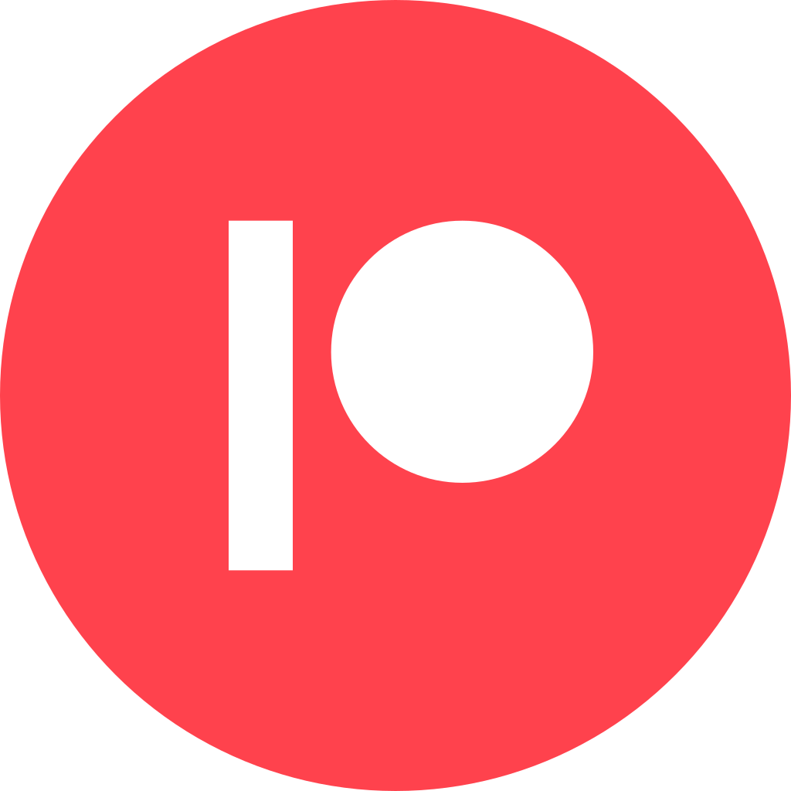

```{image} Docs/JWST_cloud1.jpg
---
name: JWST Nircam
---
```

# Welcome  

````{margin} 

```{image} Docs/Vincent-Deguin-OpenUniversity50_crop.jpg
```

<br><br>
**Vincent Deguin** () 


 PhD student

 The Open university, UK

 vincent.deguin@open.ac.uk

 [Deugz](https://github.com/Deugz)

 **To do**

 **To do**


````

## On my academic profile


My name is  [Vincent Deguin](https://50.open.ac.uk/photography/vincent), I am an Astrophysics PhD student at the Open University and my PhD focus on: 

<p class="emphase">Experimenting with the earliest stages of planet formation</p>

I am particulary interested in understanding the key role that ice (coating interstellar dust grains) plays in that respect (both from a physical and chemical point of view). I have an insatiable appetite for Open Science, that is unfortunately overlooked by the scientific community. This web-site is an attempt to make the outputs of my scientific journey as **open, accesible and reproducible** as possible, and is dived in 3 main sections:


::::{grid} 3
:::{grid-item-card}
:link: Research/Research_Main.html
**Research** <span style="float: right">&#10024;</span>
^^^

My research outputs, classified by projects, written in a creative and open access format. 

:::
:::{grid-item-card}
:link: Teaching/Teaching_main.html
**Teaching** <span style="float: right">&#128640;</span>
^^^

Teaching material based on what I learned during my scientific journey and collaborative space.

:::

:::{grid-item-card}
:link: Blog/Blog_Main.html
**Blog** <span style="float: right">&#128165;</span>
^^^

Because why not ?

:::
::::

```{warning}
- Unless clearly stated, the content of this *web-site* have **not been peer-reviewed** and must be taken with caution.

- Reviewing can be achieved on this web-site using `hypothesis` (buttons on the right corner).

- **Version**: 0.1.1 (Aug-2022)
```

### Who are you ?

````{margin} 

```{image} Docs/Svg_icons/Under_construction.svg
:width: 65px
```


```{admonition} Idea for later

- Add span div that appear when the fish in aquarium is hovered.
- Create specific admonitions for each fish type
- Add student fish (floating on his back at surface ^^)

```

````


I aim to deliver content for **everybody** `interested in Science`, so let me know who you are and I will point you in the right direction. Let me take advantage of those presentation to tell you that this project is very much in **construction**, be mindfull of it.


<article id="P1">
    
<div id="subdiv2-3">


    
```{image} Docs/Aquarium.png
---
name: Aquarium
---
```

</div>
    
<div id="subdiv1-3">    

**Legend**
    
 Anyone

 Friends/Colleagues

 Teachers
    
 Researchers (other fields)
    
 Researchers (my field)
    
 Supervision team

</div>
    
</article>

## Science For The People 

<p class="emphase">Empower Researchers with an <strong>Open Toolbox</strong> to <strong>Self Publish</strong></p>

```{warning}
Well I mean **finish my PhD** first, may be come out with a good thesis and a dirty web-site example, and then we will see,
```

::::{grid} 3
:::{grid-item-card}
:link: Projects/Science_ft_People.html
**Project Development**
^^^

  good starting point

:::
:::{grid-item-card}
:link: Projects/Manifesto.html
**Manifesto** 
^^^

Why?

:::

:::{grid-item-card}
:link: BProjects/Contribute.html
**Contribute**
^^^
How?
:::
::::


## Research 

### Introduction

````{margin} 

```{note} 
**Anita Dawes** has been my supervisor during the 2<sup>nd</sup> half of my PhD.

- [gender issues in STEM](https://www.youtube.com/watch?v=IDpognCJK9k&list=PLF394wWsaW_DXpWNlWGMN5jaIA0gHqJuv&index=5) 

```

````
<br>

<video src="_static/videos/EU Space Awareness Career Interviews Anita Dawes, Astrochemist __ FULL 3 min version.mp4" width="100%" height="" controls>
  Your browser does not support the video tag.
</video>

### My projects

:::::{div} full-width
::::{card-carousel} 2

:::{card} 
**Stairway to Heaven**
^^^

*Experimenting with the earliest stages of planet formation* (Part 2)


- Job Type: PhD
- Discipline: Astrophysics / Engeneering / Material Sciences
- Duration: 4.5 years

+++
<div class="wrapper">
 &#x2192; <button class="button"><span> <a href="https://deugz.github.io/nb-phd/_build/html/"  title= "" target="blank"> Jupyter Book </a></span></button> 
</div>
:::

:::{card} 
**Museum of non result**
^^^

*Experimenting with the earliest stages of planet formation* (Part 1)

- Job Type: PhD
- Lead supervisor: Helen Fraser
- Discipline: Astrophysics / Engeneering / Material Sciences
- Duration: 4.5 years
- Status: ?


+++
<div class="wrapper">
&#9989; &#x2192; <button class="button"><span> <a href="https://deugz.github.io/nb-museum/_build/html/"  title= "" target="blank"> Jupyter Book </a></span></button> 
</div>
:::

:::{card} 
**First steps**
^^^

*Photochemistry of Fe:H<sub>2</sub>O adducts in argon matrixes: a combined experimental and theoretical study in the mid-ir and uv-visible regions*

- Job Type: Internship
- Lead supervisor: Jennifer Noble
- Discipline: Astrochemistry
- Duration: 2 month
- Status: Finished 

+++


&#9989; &#x2192;  **Scientific publication**  &#x2192; <a href="https://pubs.acs.org/doi/abs/10.1021/acs.jpca.7b09681"></a> or  {cite}`Deguin2018`
:::

:::{card}
**Condor Project**
^^^

Sprinkle a lot of this {cite}`Hague2020` on top of that {cite}`Souza2017` and you get a pretty cool project:  

*3D tissue modelling with the CONDOR (link) model* 


- Job Type: Research Associate (Postdoc)
- Discipline: Computer Sciences / Biologie
- Duration: 2 month


+++


&#x26D4; - **commercial application**
:::

::::
:::::

### Your Tools

:::::{div} full-width
::::{grid} 1 1 2 4
:class-container: text-center
:gutter: 3

:::{grid-item-card}
:class-header: bg-light

 Hypothesis
^^^
`hypotesis` (needs login), top-right corner buttons (include image) allow you to annotate every word in this web-site.
- **Peer Review**

:::

:::{grid-item-card}
:class-header: bg-light

 Utterance 
^^^
`Utterances` (needs login - Github account) is a space at the bottom of each page for more relax comments.
- **Discussion**

:::

:::{grid-item-card}
:class-header: bg-light

 Binder
^^^

`Binder`
Interact with the code

- **Interaction**

:::

:::{grid-item-card}
:class-header: bg-light

 Github / Figshare
^^^

`Github`, `Figshare`
Code and data repositories.
- **Reproducibility**


:::


::::
:::::


## Teaching

````{margin} 

```{admonition} Colaboration 
What is this all about

- link to colaboration workflow
```

````

<article id="P1">
    
<div id="subdiv2">


:::{grid-item-card}
**Teaching** <span style="float: right">&#128165;</span>
^^^
Learn from multiple (&#129310;) scientists about topics like:
  
- [Astronomy](https://deugz.github.io/nb-teaching/_build/html/Bitesize/Astronomy/Astronomy_101/Astronomy_101.html)
- Water
- Planet formation
- The Jupyter ecosystem
- Python
- 3JS
    
+++
<div class="wrapper">
<button class="button"><span> <a href="https://deugz.github.io/nb-teaching/_build/html/"  title= "" target="blank"> Jupyter Book </a></span></button> 
</div>
:::
    
</div>
    
<div id="subdiv2">    
  
Teaching is an important part of the life of a researcher and deserve its own book (click on card or individual courses). However, it is a task that is often controlled and managed by heavy administrative bodies. I think, however that every researcher should be given the chance to share his knowledge in a creative and appealing fashion (that is terribly lacking in academia).
    
</div>
    
</article>


<article id="P1">
    
<div id="subdiv2">

- **Bitesize**

Small lessons to introduce specific topics that I encounter during my research journey.  


</div>
    
<div id="subdiv2">    


- **Practicle**

Some practical tutorials which will accompanied you in producing some material.


</div>
    
</article>

## Comments

<script src="https://utteranc.es/client.js"
        repo="Deugz/nb_master"
        issue-term="pathname"
        theme="github-light"
        crossorigin="anonymous"
        async>
</script>